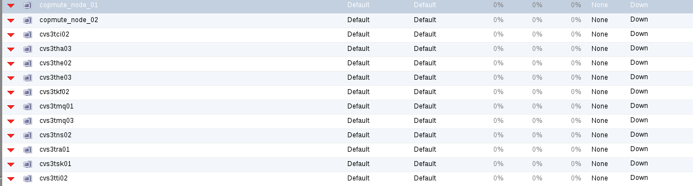

# oVirt/RHEV Dynamic Inventory


Dynamic inventories for RHEV/oVirt to use it from Ansible

## Requirements

- [oVirt Python SDK](http://www.ovirt.org/develop/release-management/features/infra/python-sdk/) < version 4.0
- Credentials to access to an installation of oVirt or RHEV.

## How this works
We have 2 main functionalities , the first one is that this module works with ansible.cfg file in two new sections:
- ovirt
- ovirt-classifier

The first one is to set where are the ovirt-manager to log in. The second one is to select which groups will contain the Dynamic Inventory based on a pattern with a variable called **basename**, and suffixes to complete the nodename, lets go on a real example:

This is our nodes inside of oVirt-Manager:


- Input:

```
python rhev36.py
```

- Output:

```
[SPLUNK_INDEXER]
cvs3tsk01
[RABBITMQ]
cvs3tmq01
cvs3tmq03
[KAFKA]
cvs3tkf02
[HEAT]
cvs3the02
cvs3the03
[CINDER-STORAGE]
cvs3tci02
[NTP-SERVERS]
cvs3tti02
[RALLY]
cvs3tra01
[INTERNAL-HAPROXY-MASTER]
cvs3tha03
[NEUTRON-AGENTS]
cvs3tns02
```

- Ansible.cfg sample:

```
[ovirt]
host = 'https://ovirt36'
port = 443
user = 'admin@internal'
passw = 'unix1234'
ssl_insecure = True
logfile = 'DynInvOvirt.log'

[ovirt-classifier]
basename = 'cvs3t'
group_rabbitmq = 'mq'
group_neutron-agents = 'ns'
group_cinder-storage = 'ci'
group_heat = 'he'
group_internal-haproxy-master = 'ha'
group_ntp-servers = 'ti'
group_kafka = 'kf'
group_rally = 'ra'
```

As you see the patter "group_XXX" will create a group name called XXX and the value will be the concatenation between **basename** + the group_XXX value (EG):

```
[ovirt-classifier]
basename = 'testnode_'
group_rabbitmq_nodes = 'rabbit'
```

This formation will create this structure:
```
[RABBITMQ_NODES]
testnode_rabbit01
testnode_rabbit02
testnode_rabbit03
testnode_rabbit11
testnode_rabbit_dev_01
```
